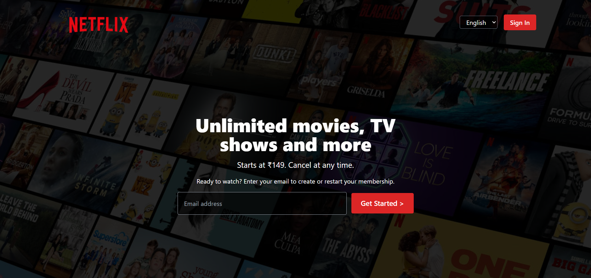
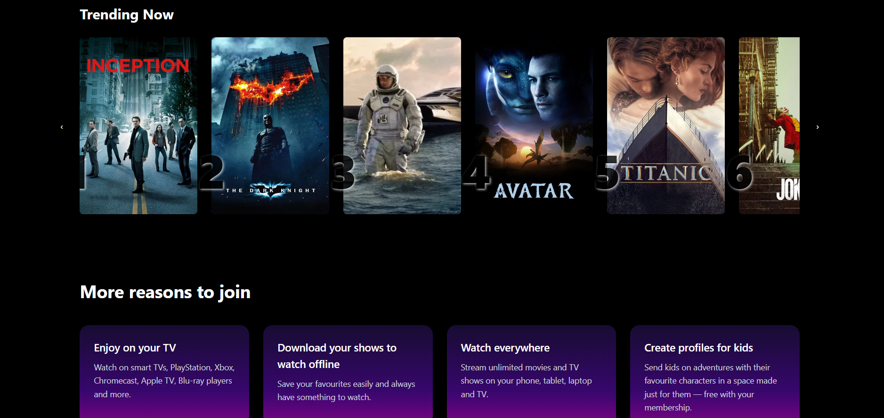
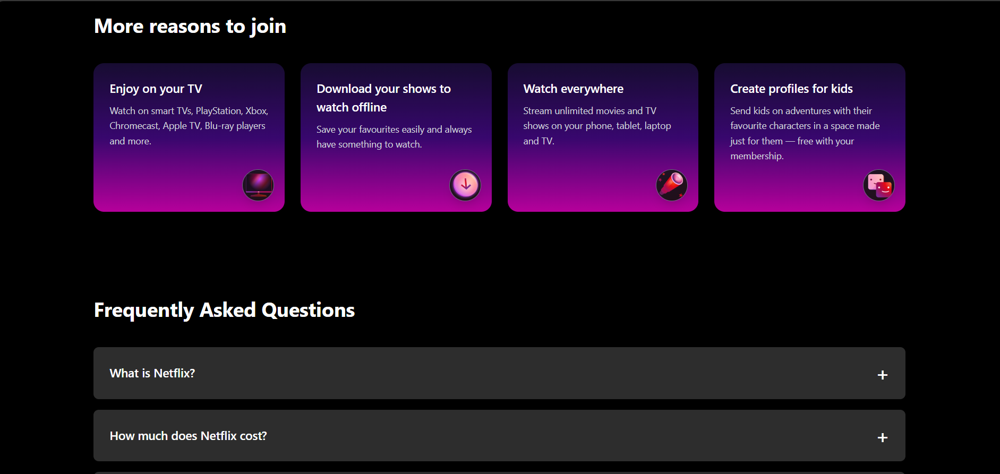
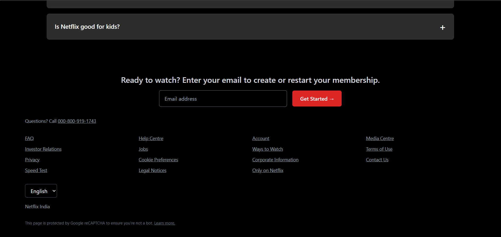
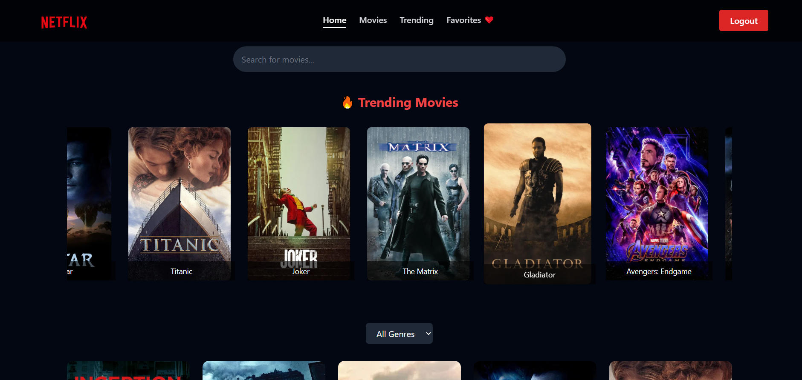
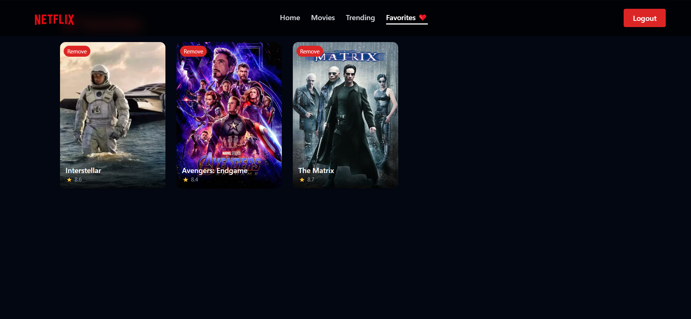

# 🎥 Netflix Clone - React + Redux + Firebase (In Progress)

A **Netflix-inspired web app** built using **React, Redux Toolkit, Tailwind CSS**, and **Firebase Authentication** (currently under setup).  
This project demonstrates **frontend development skills**, state management with **Redux**, and smooth UI using **Tailwind CSS**.  

> 🧑‍💻 You can log in using any email and password (demo authentication).  
> 📱 Firebase Phone Authentication setup is in progress and will be added soon.

---

## 🚀 **Live Demo**
🔗 [Will be added after deployment]

---

## 🧩 **Features**

✅ **User Authentication (Login / Logout)**  
- Currently supports basic login using localStorage  
- Firebase phone-based OTP authentication setup in progress  

✅ **Responsive Navbar with Smooth Scroll & Mobile Menu**  
- Adaptive design for all devices  
- Includes a hamburger menu for mobile view  

✅ **Search & Filter Movies**  
- Search movies by title  
- Filter by genre (Action, Sci-Fi, Adventure, Fantasy, etc.)  

✅ **Trending Section**  
- Highlights top-rated movies dynamically  

✅ **Favorites Section ❤️**  
- Add or remove favorite movies  
- Favorites persist while logged in  

✅ **Movie Detail Page**  
- View overview, rating, genre, and release date  

✅ **Smooth Animations & Tailwind Styling**  
- Netflix-inspired gradient tones  
- Blurred background with hover transitions  

---

## 🛠️ **Tech Stack**

| Category | Technologies Used |
|-----------|-------------------|
| **Frontend** | React.js, Redux Toolkit, Tailwind CSS |
| **State Management** | Redux Toolkit (createSlice, createAsyncThunk) |
| **Routing** | React Router v6 |
| **Authentication** | Firebase Authentication (Phone Auth setup in progress) |
| **Deployment (Planned)** | Vercel / Netlify |
| **Icons** | Lucide React |

---

## 📂 **Folder Structure**

src/
┣ components/
┃ ┣ Navbar.jsx
┃ ┣ MovieCard.jsx
┃ ┣ SearchBar.jsx
┃ ┗ TrendingMovies.jsx
┣ features/
┃ ┣ auth/
┃ ┃ ┗ authSlice.js
┃ ┗ movies/
┃ ┃ ┗ moviesSlice.js
┣ pages/
┃ ┣ HomePage.jsx
┃ ┣ MovieDetailPage.jsx
┃ ┣ FavoritesPage.jsx
┃ ┗ LoginPage.jsx
┣ assets/
┃ ┗ netflix_logo.png
┃ ┗ 1net.png
┃ ┗ 2net.png
┃ ┗ 3net.png
┃ ┗ 4net.png
┣ App.jsx
┣ firebase.js
┗ main.jsx


---

## 🔐 **Firebase Setup (In Progress)**

Firebase configuration is initialized in  
`src/firebase.js` using **Firebase Auth + OTP Login**.

- **Phone Number Authentication** setup in progress  
- Will support OTP verification soon  
- Error handling & billing setup under configuration  

---

## 📸 **Screenshots**


```markdown

### ❤️ Login Page






### 🏠 Homepage


### ❤️ Favorites Page



